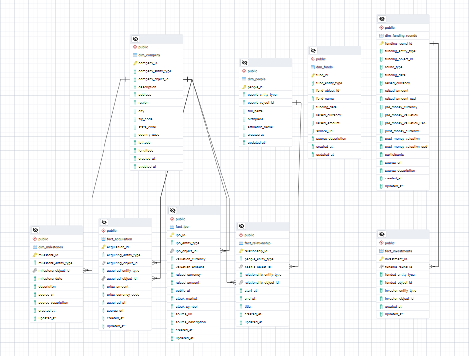

# Data Pipeline Project Documentation

## Overview

This project involves building a data pipeline to integrate data from multiple sources related to the startup ecosystem. The data includes startup investment information, people-related data, and company milestones from an external API. The goal is to create a unified view of the startup analytics ecosystem.

## Table of Contents

1. [Requirements Gathering & Proposed Solution](#requirements-gathering--proposed-solution)
   - [Background Problem](#background-problem)
   - [Proposed Solution](#proposed-solution)
   - [Pipeline Design](#pipeline-design)
2. [Design Target Database](#design-target-database)
   - [Source to Target Mapping](#source-to-target-mapping)
   - [ERD of Warehouse](#erd-of-warehouse)
3. [ETL Pipeline Design](#etl-pipeline-design)
   - [Tools & Libraries](#tools--libraries)
   - [ETL Workflow](#etl-workflow)
   - [Log System](#log-system)
   - [Validation System (Data Profiling)](<#validation-system-(data-profiling)>)
   - [References](#references)
4. [Prerequisites](#prerequisites)

---

## Requirements Gathering & Proposed Solution

### Background Problem

The startup ecosystem generates vast amounts of data from various sources:

1. **Startup Investment Database**: Contains information about companies and their investment processes.
2. **Files with People Information**: Includes data about founders, CEOs, and board members.
3. **Company Milestone Data from API**: Tracks significant events in a company's lifecycle.

The challenge is to merge these disparate data sources into a cohesive data warehouse for analysis.

### Proposed Solution

1. **Data Profiling**: Analyze each data source to understand its structure and quality.
2. **Data Pipeline Design**: Create a pipeline to extract, transform, and load (ETL) data into a target database.
3. **Target Database Model**: Design a dimensional model for the data warehouse.

### Pipeline Design

The pipeline consists of the following layers:

1. **Staging Layer**: Raw data extracted from sources.
2. **Warehouse Layer**: Transformed and integrated data stored in a dimensional model.
3. **Log System**: Tracks pipeline execution and errors.

#### Validation System

- Data quality checks at each stage (e.g., null checks, data type validation).
- Logging of validation results for auditing.

---

## Design Target Database

### Source to Target Mapping

Please look: [Source to Target Mapping](#source_to_target_mapping.xlsx)

### ERD of Warehouse

The target database uses a dimensional model with the following tables:

- **Fact Tables**: `fact_relationships`, `fact_investments`, `fact_acquisition`, `fact_ipo`.
- **Dimension Tables**: `dim_company`, `dim_people`, `dim_milestones`, `dim_funding_rounds`, `dim_funds`.

## ETL Pipeline Design

### Tools & Libraries

- **PySpark**: For scalable data processing.
- **PostgreSQL**: For the database (data source, staging, warehouse)
- **Docker**: For containerized environment setup.

### ETL Workflow

1. **Extract**:
   - Read data from CSV files, database (source) and API.
   - Load raw data into the staging layer (PostgreSQL).
2. **Transform**:
   - Clean, normalize and standardize data (e.g., handle missing values, convert data types).
   - Join related datasets (e.g., link people to companies).
   - etc
3. **Load**:
   - Write transformed data to the warehouse layer.
   - Update dimension and fact tables.

#### Log System

- Log pipeline execution steps and errors to a `pyspark_task_logger` database in PostgreSQL.

#### Validation System (Data Profiling)

- Validate data quality, data profiling (e.g., row counts, unique checks), save as JSON on data_profiling folder (local).
- Log validation results for monitoring.

### References

- GitHub Repository: https://github.com/Kurikulum-Sekolah-Pacmann/project_data_pipeline.git
- Documentation Guide: GitHub Documentation Handbook

---

## Prerequisites

- Docker installed.
- Clone the repository:
  `git clone https://github.com/Kurikulum-Sekolah-Pacmann/project_data_pipeline.git`
  Build: `docker compose up --build --detach`
  Copy Driver: `docker cp driver/postgresql-42.6.0.jar pyspark_project_container:/usr/local/spark/jars/postgresql-42.6.0.jar`
- To access the notebook: localhost:8888
- To obtain the the token, run: `docker logs pyspark_project_container -f`
